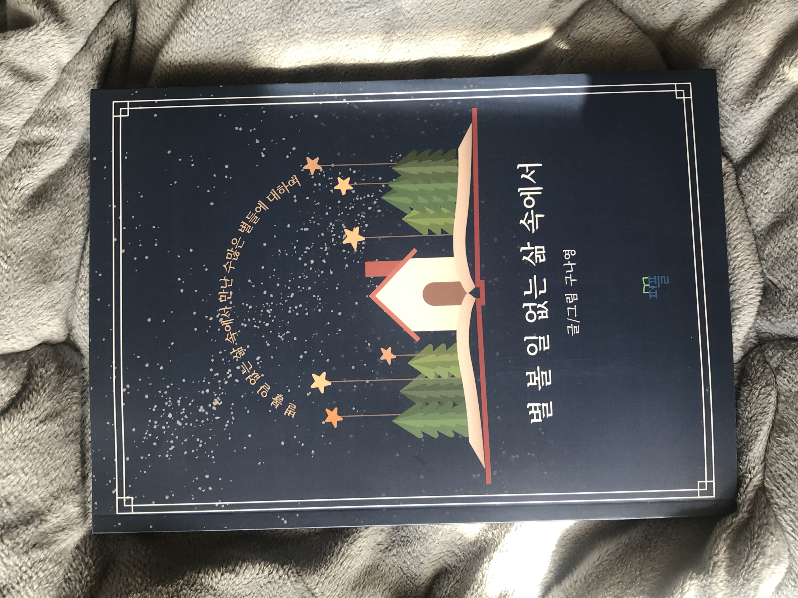
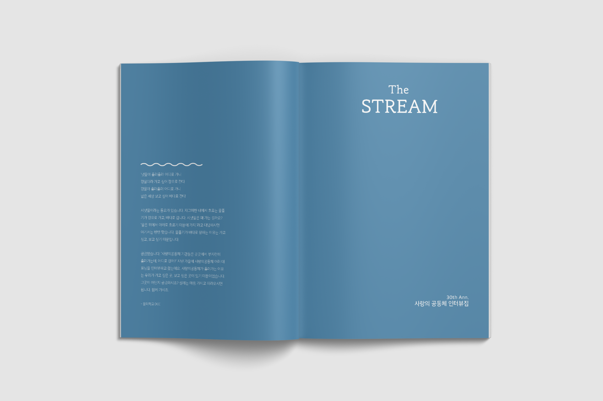
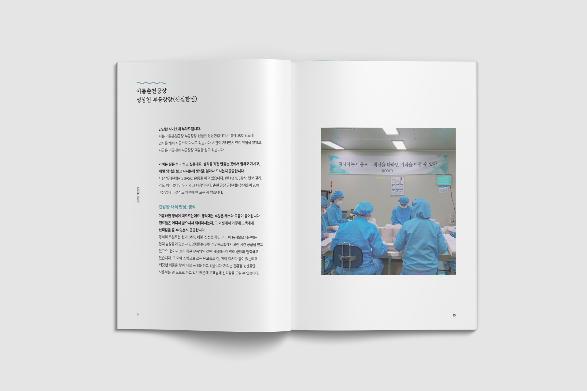
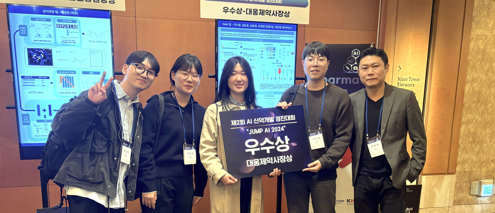
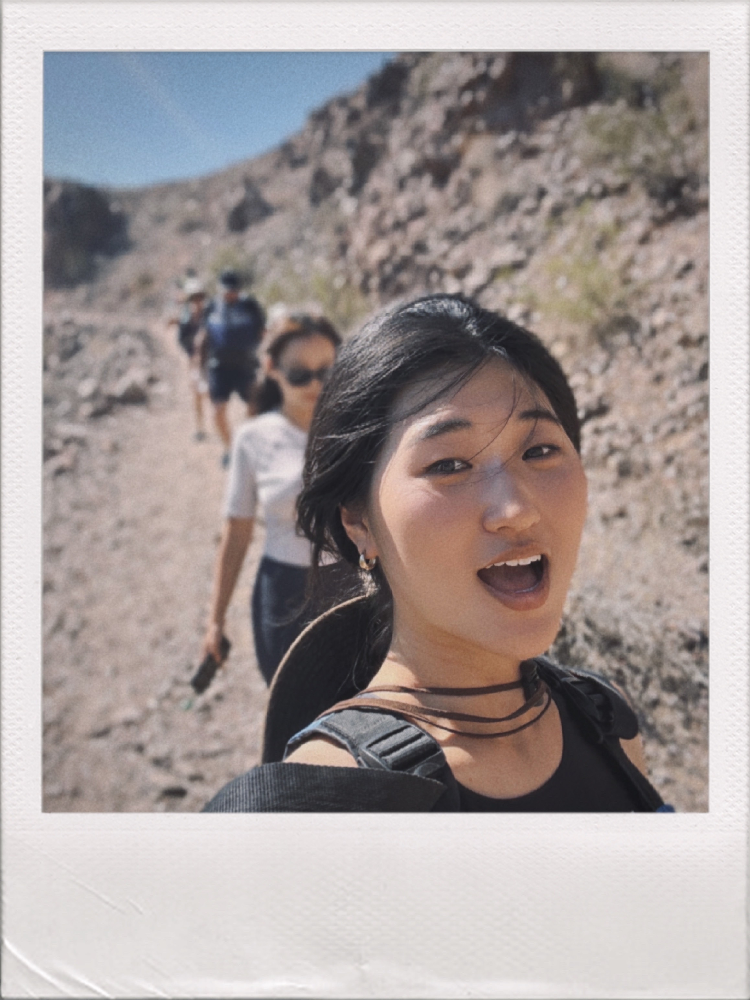
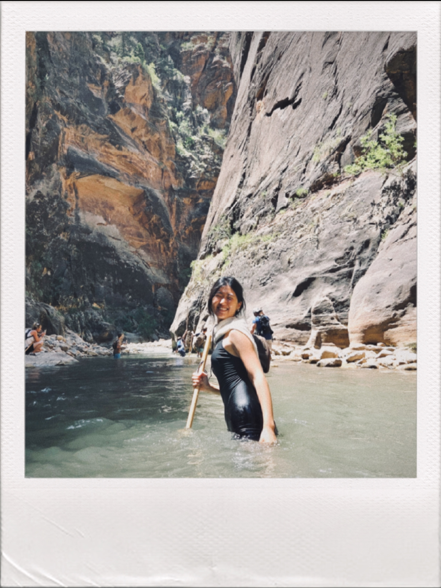
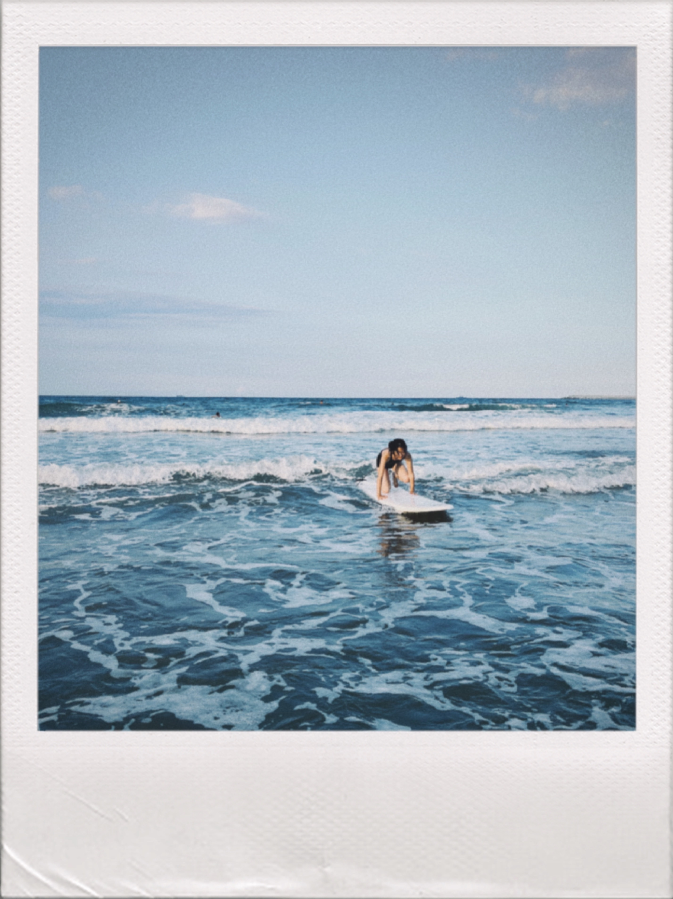



I’m driven by curiosity, creativity, and the joy of seeing ideas come to life. I finish what I start, learn quickly, and enjoy bringing people together to share what we know.

I value persistence, adaptability, and the humility to keep learning. 

## Creative Projects

**I express ideas through writing and visual art.**
At 17, I published a [book](https://product.kyobobook.co.kr/detail/S000060619640) of bedtime stories, poems, and essays—doing the writing, illustrations, and layout myself. I also led a team creating a magazine that featured interviews with business leaders from different industries.

Seeing these projects through from vision to finished product taught me how to break complex work into manageable steps, balance creative vision with execution, and iterate until the result clicks.

    
    
    

## Learning Across Boundaries
**I’ve always been drawn to exploring across disciplines.** My path to research started in psychology in my junior year of high school. I completed my BA in two years at age 18 through a self-directed program, chasing fundamental questions about human cognition. Then cognitive neuroscience pulled me in. Eventually, I became obsessed with the intersection of AI and biology. I pursued that passion through a BS+BE in Life Science & AI Interdisciplinary Studies.

During my second bachelor's degree, I participated in **Lunch & Learn** sessions where peers and I taught each other about new tools, concepts, and research, plus whatever sparked our curiosity over lunch. That collaborative environment became something rare: a place where we shared our growth, asked hard questions together, and actually knew each other—not just as peers, but as intellectuals with real stakes in each other's development.That bond made us all sharper thinkers.

I realized that knowledge shared isn't diminished—it multiplies in unexpected ways. And teaching peers deepens your own understanding in ways learning alone never can. That's the culture I'm building everywhere I go.

    

## Outdoor Adventures & Resilience
Surfing near campus, hiking national parks, or running for miles—these are my reset buttons. 

At age 12, I completed a **150km trek across Korea** over five days, carrying everything I needed on my back. That experience fundamentally rewired how I approach uncertainty and fatigue. I learned that the discomfort doesn't break you—it's just information. 

*You adjust, you keep going, and you're stronger on the other side.* I carry that lesson into every complex project, every research challenge, every moment I want to quit.

    
    
    

## Adaptability & Connection
**I adapt quickly and connect with diverse perspectives.**
Between boarding school and residential college, I've lived with 30+ roommates from different backgrounds. At Handong Global University, I served as an exchange student helper especially for those from Canada, France, Pakistan, and Spain to navigate residential college culture, academic and Korean cultural adjustment.

    
    
    

